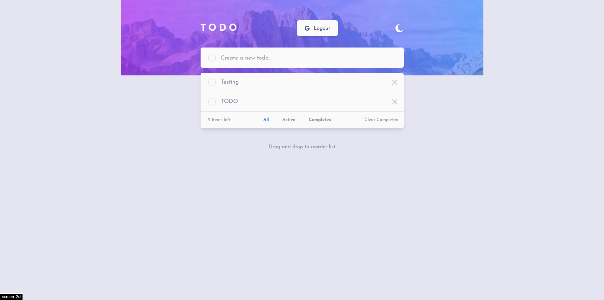
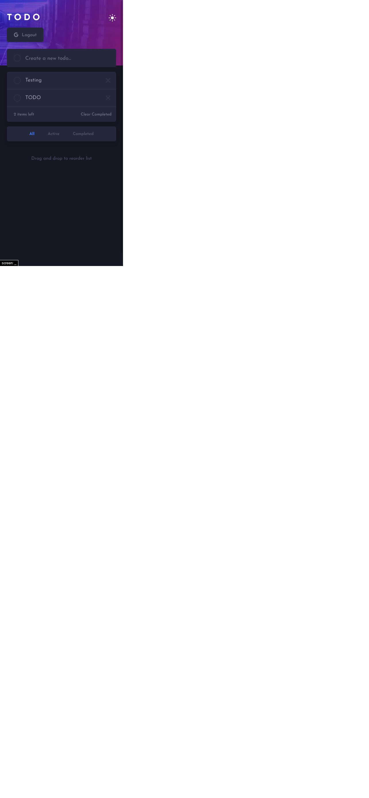

# Frontend Mentor - Todo app solution

This is a solution to the [Todo app challenge on Frontend Mentor](https://www.frontendmentor.io/challenges/todo-app-Su1_KokOW). Frontend Mentor challenges help you improve your coding skills by building realistic projects.

## Table of contents

- [Overview](#overview)
    - [The challenge](#the-challenge)
    - [Screenshot](#screenshot)
    - [Links](#links)
- [My process](#my-process)
    - [Built with](#built-with)
- [Author](#author)

## Overview

### The challenge

Users should be able to:

- View the optimal layout for the app depending on their device's screen size
- See hover states for all interactive elements on the page
- Add new todos to the list
- Mark todos as complete
- Delete todos from the list
- Filter by all/active/complete todos
- Clear all completed todos
- Toggle light and dark mode
- **Bonus**: Drag and drop to reorder items on the list

### Screenshot

### Links

- Solution URL: [Solution](https://www.frontendmentor.io/solutions/todo-created-with-nextjs-tailwindcss-and-typescript-fszz75ANG)
- Live Site URL: [Live Site](https://todo-app-next-one.vercel.app/)

## My process

### Built with
- Flexbox
- Mobile-first workflow
- [React](https://reactjs.org/) - JS library
- [Next.js](https://nextjs.org/) - React framework
- [Tailwind](https://tailwindcss.com/) - For styles
- [TypeScript](https://www.typescriptlang.org/) - For types
- [Firebase](https://firebase.google.com/) - For backend

## Author
- [Website](https://www.bartoszformanowski.me/)
- Frontend Mentor - [@BartekFo](https://www.frontendmentor.io/profile/BartekFo)
- Twitter - [@Bartosz_For](https://twitter.com/Bartosz_For)

